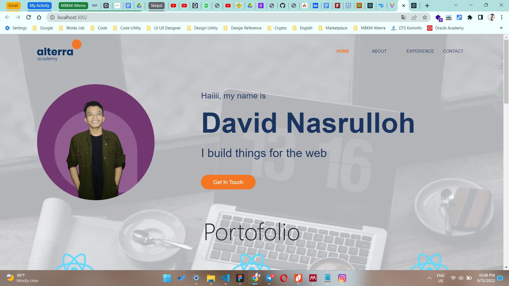
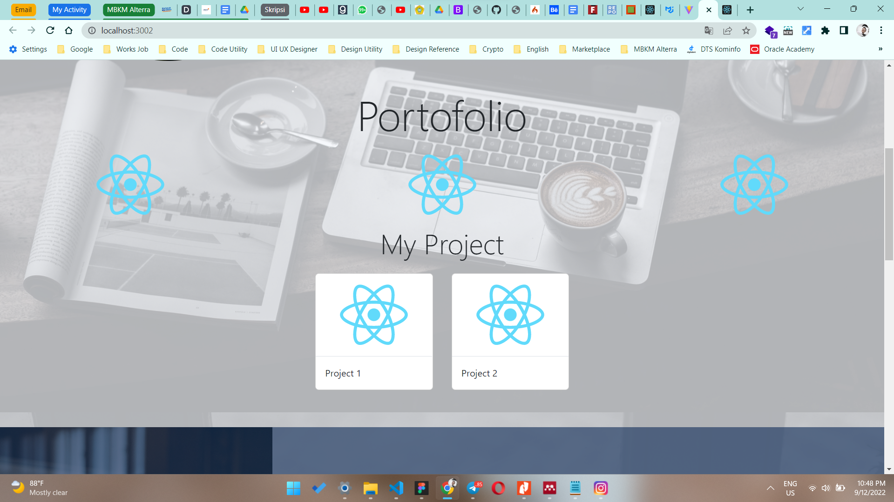
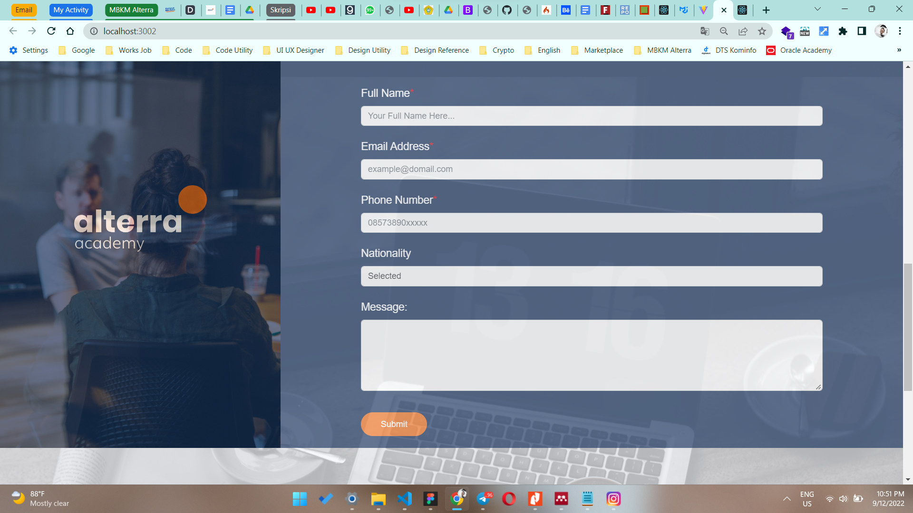
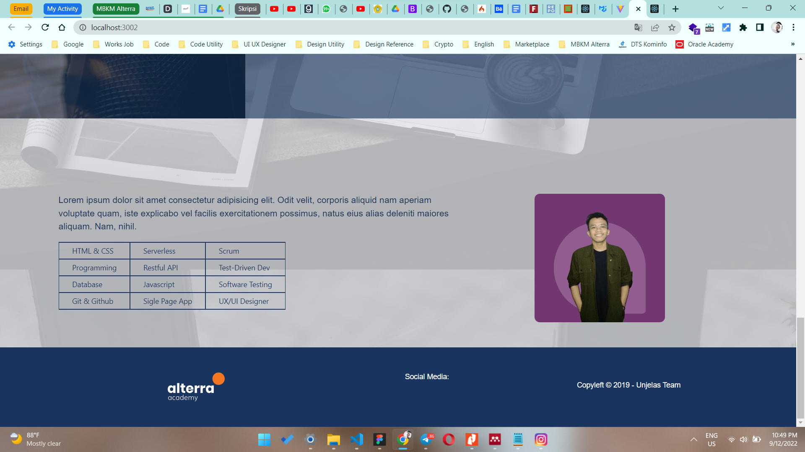

# 11 \_ Introduction React

```
Nama  : David Nasrulloh
Email : davidkrb52@gmail.com
Univ  : Universitas Trunojoyo Madura
Prodi : Sistem Informasi
```

---

Dalam materi ini, mempelajari:

- Introduction
- Javascript refreshment
- React Fungdamental
- Event Handling
- React hooks
- React routing
- Forms
- Global State Managemen & Data Fetching
- Testing & Deployment

---

## Resume

---

##### Apa itu React ?

- Library javascript untuk membuat user interface (UI) yang interaktif dan cepat pada web maupun mobile
- Open source yang di maintain oleh Facebook
- Library javascript untuk membuat user interface (UI) yang interaktif dan cepat pada web maupun mobile
- Open source yang di maintain oleh Facebook
- Pada arsitektur MVC (Model – View – Controller), Reactjs hanya akan mengambil peran pada layer View saja.

##### Library dan Framework untuk membuat UI

- Jquery (Library)
- React (Library)
- Angular (Framework)
- Vue (Framework)
- NextJS (Framework)

##### Kenapa menggunakan React

- Deklaratif
- Berbasis Komponen
- Belajar sekali, tulis dimana saja
- Sudah teruji
- Teknologi yang popular

##### Virtual DOM

> Kenapa virtual DOM = DOM manipulation is the heart of the modern interactive web

##### Masalah yang dihadapi dengan DOM manipulation

1. DOM manipulation secara manual dapat membuat code berantakan
2. Sulit untuk mengingat DOM state sebelumnya
3. Jauh lebih lambat daripada operasi javascript pada umumnya

##### Set up Development Environment

- Tools yang diperlukan
- Membuat aplikasi React menggunakan Create App

##### Tools yang diperlukan

- Browser (Google Chrome)
- Text Editor / IDE (Visual Studio Code)
- Command Line Shell (Git bash)

### output praktikum:

##### Halaman Home






---

12 September 2022 | David Nasrulloh
