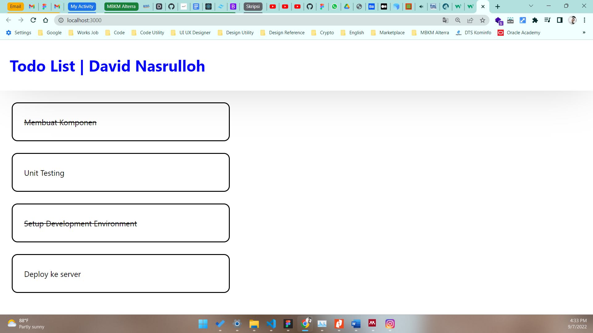

# 12 \_ React Fundamental

```
Nama  : David Nasrulloh
Email : davidkrb52@gmail.com
Univ  : Universitas Trunojoyo Madura
Prodi : Sistem Informasi
```

---

Dalam materi ini, mempelajari:

- Apa itu JSX
- Kenapa menggunakan JSX ?
- Jsx Vs React.createElement
- Spesifikasi Jenis Elemen React
- Menaruh Expresion pada JSX
- JSX Adalah Expression
- Menspesiifikasikan Elemen anak dengan JSX
- Apa itu Component ?
- Membagi UI menjadi beberapa komponen
- Function and class component
- Membuat dan Merender component
- Apa itu props ?
- One Way data flow pada react
- Komposisi komponen
- Render Bersyarat
- Render List
- Key
- Class dan CSS
- Atribut style
- Modul CSS

---

## Resume

---

##### Apa itu JSX ?

Singakatan dari Javascript JSX, Extensi pada Javascript

```
const element = <h1>Hello, World!</h1>
```

##### Kenapa menggunakan JSX ?

- JSX dibuatkan berdasarkan fakta kalau logika rendering sangat terikat dengan logic UI
  Separation of TechnoloJSX dibuatkan berdasarkan fakta kalau logika rendering sangat terikat dengan logic UI
  > Separation of Technology -> Separation of Concerns

##### JSX vs React.createElement

- Kita tidak harus menggunakan JSX, tapi JSX memudahkan kita menulis aplikasi React
- Syntactic Sugar dari fungsi

```
React.createElement(component, prop, ...children)
```

##### Spesifikasi jenis Element React

- Kapitalisasi untuk komponen React
- Huruf kecil (lowercase) untuk komponen bawaan

##### Menaruh expression pada JSX

- Kita dapat menaruh ekspresi JS yang valid pada JSX dengan menggunakan kurung kurawal.

##### JSX adalah expression

##### Menentukan atribut dengan JSX

- Tanda kutip untuk menentukan string literal
- Kurung kurawal untuk menyematkan ekspresi JavaScript
- React DOM menggunakan camelCase sebagai konvensi penamaan

##### Menspesifikasikan Elemen Anak dengan JSX

- Jika tag bersifat kosong (tidak memiliki elemen anak), kita bisa saja menutupnya secara langsung dengan />
- Tag JSX dimungkinkan untuk memiliki elemen anak

##### Apa itu component ?

> Komponen React adalah bagian kode yang dapat digunakan kembali yang digunakan untuk menentukan tampilan, behavior, dan state sebagian UI

##### Membagi UI menjadi beberapa komponene

> Membagi UI menjadi dengan beberapa komponen yang lebih kecil

##### Apa itu props

1. Singkatan dari properties, membuat kita dapat memberikan argumen / data pada component.
2. Props membantu untuk membuat komponen menjadi lebih dinamis
3. Props dioper ke component sama seperti memberikan atribut pada tag HTML
4. Props pada component adalah read-only dan tidak dapat diubah.

Komposisi komponen adalah Kontainment, dan Spesialisasi

##### Livecycle method yang umum

1. render()
2. componentDidMount()
3. componentDidUpdate()
4. componentWillUnmount()
   Lifecycle method lainnya
5. shouldComponentUpdate()
6. static getDerivedStateFromProps()
7. getSnapshotBeforeUpdate()

```
render()
> Fungsi yang paling sering dipakai
> Required pada class component
> Pure function. Tidak boleh ada setState()
```

```
componentDidMount()
> Dipanggil ketika component sudah di render untuk pertama kali
> Tempat yang tepat untuk pemanggilan API
> Boleh ada setState()
```

```
componentDidUpdate()
> Dipanggil ketika terjadi update (props atau state berubah)
```

```
componentWillUnmount()
> Dipanggil ketika component akan dihancurkan
> Cocok untuk clean up actions
```

##### Render Bersyarat

Pada React, Kita dapat membuat komponen berbeda yang mencakup perilaku yang dibutuhkan. Lalu, Kita dapat me-render hanya beberapa bagian saja, berdasarkan state dari aplikasi Anda.

- Menggunakan If
- Inline If dengan operator &&
- Inline If-Else dengan ternary conditional operator
- Mencegah komponen untuk rendering

##### Render List

Kita dapat membangun koleksi dari beberapa elemen dan menyertakannya dalam JSX menggunakan tanda kurung kurawal {}.

##### Key

Key membantu React untuk mengidentifikasi item mana yang telah diubah, ditambahkan, atau dihilangkan.

##### Dalam membuat Struktur Direcctory

React tidak memiliki pendapat tentang bagaimana cara memasukkan file ke folder
namun dapat dihindari terlalu banyak nya nesting

##### Class CSS

layaknya mengakses file CSS dalam native, dapat dilakukan dengan 3 cara (internal, line, dan eksternal)

---

### output praktikum:

##### File 1



---

07 September 2022 | David Nasrulloh
