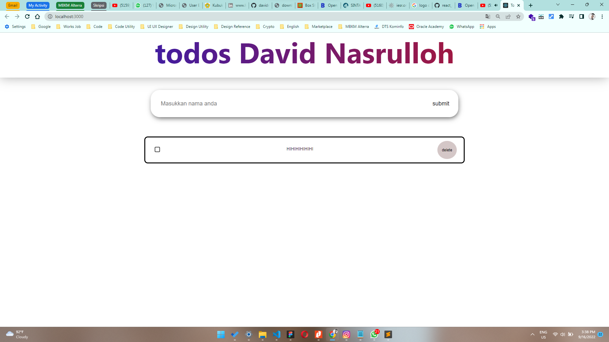

# 13 \_ Event Handling

```
Nama  : David Nasrulloh
Email : davidkrb52@gmail.com
Univ  : Universitas Trunojoyo Madura
Prodi : Sistem Informasi
```

---

Dalam materi ini, mempelajari:

- Apa itu State ?
- Stateless dan Statefull
- Handling Events

---

## Resume

---

##### Apa itu State ?

State adalah data private sebuah component. Data ini hanya tersedia untuk component tersebut dan tidak bisa di akses dari component lain.
Ciri Ciri State

1. Data yang bisa di modifikasi menggunakan setState
2. Setiap terjadi modifikasi akan terjadi render ulang
3. Bersifat Asynchronous
4. Diapakai dalam class

Perbedaan Props vs State
Props = read only, can not be modified
State = can be asynchronous, Can be modified using this.setState

##### Statefull Component dan Stateless Componenent

> Statefull Component adalah memiliki state, Component ini dibuat dengan class. kelebihan dari class component adalah memiliki lifecycle
> Stateless Component adalah tidak memiliki state hanya props. Umumnya component ini dibuat dengan function karena codenya lebih ringkas.

Komponen statefull dan stateless memiliki banyak nama berbeda
Mereke juga dikenal sebagai:

1. Smart component & Dump component
2. Container component & Presentational component

##### Perbedaan dari komponen statefull dan komponen stateless

// Stateless Component

1. Tidak tahu tentang aplikasi
2. Tidak melakukan data fetching (Pengambilan Data)
3. Tujuan utamanya adalah visualisasi
4. Dapat digunakan kembali
5. Hanya berkomunikasi dengan induk langsungnya

// Statefull Component

1. Mengerti tentang aplikasi
2. Melakukan data fetching (pengambilan data)
3. Berinteraksi dengan aplikasi
4. Tidak dapat digunakan kembali
5. Meneruskan status dan data ke anak - anaknya

##### Apa itu Handling Event

> Handling Event adalah suatu metode untuk menangani sebuah event / aksi yang diberikan pengguna kepada suatu komponen
> Event adalah suatu peristiwa yang dipicu oleh pengguna pada suatu komponen, misalnya tombol ditekan

Beberapa contoh list Event

1. Clipboard Events (Promise terpenuhi)
2. Form Events (onChange, onSubmit)
3. Mouse Event (onClick, onDoubleClick, onMouseOver)
4. Generic Events (onError, onLoad)

---

### output praktikum:

##### File 1

Ketika di Menambahkan task


Ketika task kosong


Tambah dan Checkec Task


Unchecked
Ketika task kosong


Deleted Task
Ketika task kosong


---

09 September 2022 | David Nasrulloh
