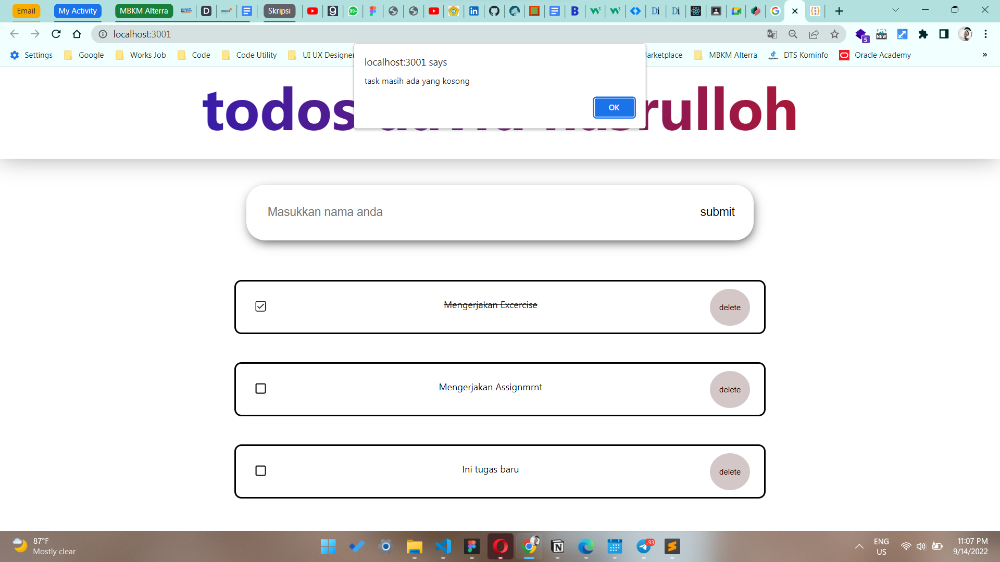

# 14 \_ React Hooks

```
Nama  : David Nasrulloh
Email : davidkrb52@gmail.com
Univ  : Universitas Trunojoyo Madura
Prodi : Sistem Informasi
```

---

Dalam materi ini, mempelajari:

- React Hooks
- Motivasi menggunakan Hooks
- Hook pada react
- Hooks dasar dan Hooks Tambahan
- Aturan pada Hooks

---

## Resume

---

##### Apa itu React Hooks ?

Hooks merupakan fitur baru di React 16.8. Dengan Hooks, kita dapat menggunakan state dan fitur React yang lain tanpa perlu menulis sebuah kelas.

##### Motivasi menggunakan hooks

- Kesulitan untuk menggunakan kembali stateful logic antar komponen
- Komponen kompleks menjadi sulit untuk dimengerti
- Kelas membingungkan manusia dan mesin

##### Hook pada react

// Hooks Dasar

1. useState
2. useEffect
3. useContext

// Hooks Tambahan

1. useReducer
2. useCallback
3. useMemo
4. useRef
5. useImperativeHandle
6. useLayoutEffect
7. useDebugValue

##### Aturan pada hooks

> Hanya Panggil Hooks di Tingkat Atas : Jangan memanggil Hooks dari dalam loops, conditions, atau nested functions

> Hanya Panggil Hooks dari Fungsi-Fungsi React : Jangan memanggil Hooks dari fungsi-fungsi JavaScript biasa.Kita dapat:, Memanggil Hooks dari komponen-komponen fungsi React, Memanggil Hooks dari custom Hooks

##### Implementasi useState dan useEffect di Component

- Menggunakan useState
- Menggunakan useEffect

##### Menggunakan useEffect

- Effect Hook memungkinkan kita melakukan efek samping (side effects) di dalam function component
- componentDidMount, componentDidUpdate, dan componentWillUnmount ≈ useEffect
- Ada dua jenis : Butuh pembersihan dan tidak butuh pembersihan

##### Membuat Custom Hooks

Membuat Hook Kita sendiri memungkinkan Kita mengekstrak komponen logika ke fungsi yang dapat digunakan lagi.

---

### output praktikum:

##### File 1

Ketika menambahkan task


Ketika task kosong


---

14 September 2022 | David Nasrulloh
