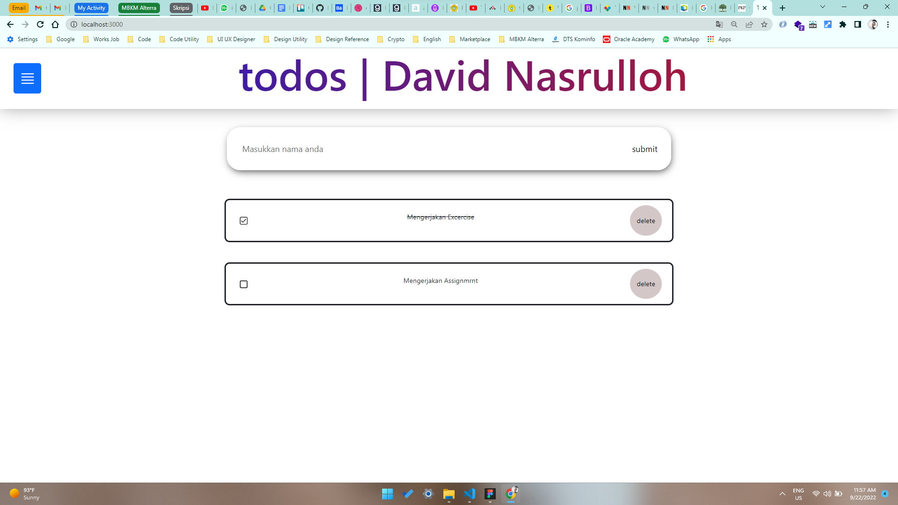
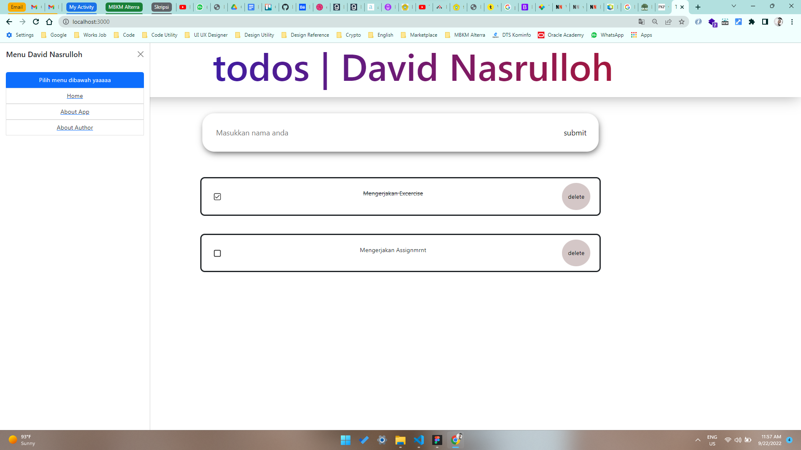
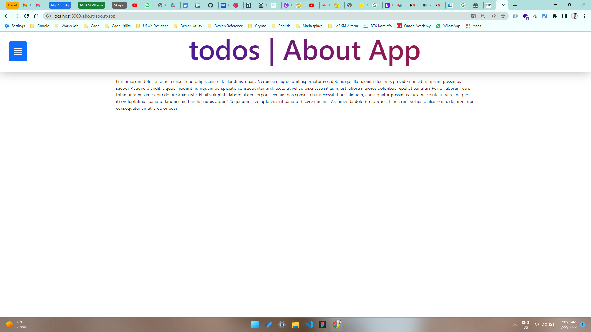
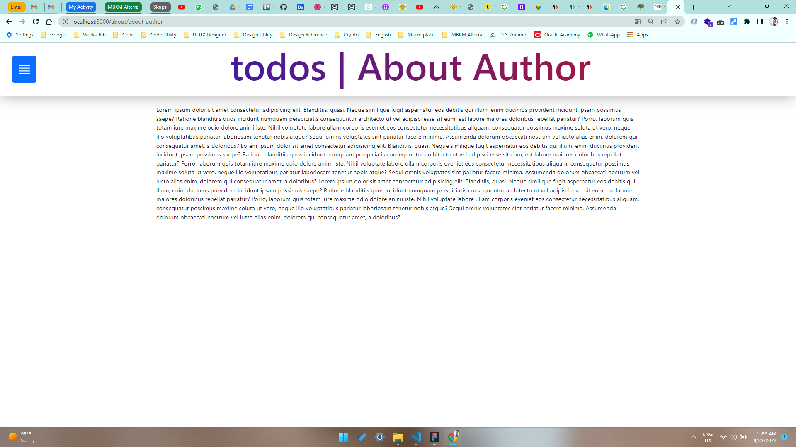

# 15 \_ React Routing

```
Nama  : David Nasrulloh
Email : davidkrb52@gmail.com
Univ  : Universitas Trunojoyo Madura
Prodi : Sistem Informasi
```

---

Dalam materi ini, mempelajari:

- Apa itu Routes
- Perbedaan Multi dan Single Page Application
- URL Parameter

---

## Resume

---

##### Apa itu Routes ?

Routes merupakan modul Dalam react yang berfungsi untuk melakukan proses navigasi pada SPA (Single page application)

##### Apa itu Multi Page Application

Multi Page Application (MPA) juga disebut dengan tradisional web app adalah jenis aplikasi website dimana perlu memuat ulang seluruh halaman web setiap kali membuat permintaan baru

##### Apa itu Single Page Application

Single Page Application (SPA) salah satu jenis aplikasi website dimana hanya 1 halaman yang menangani semua aktivitas yang terjadi dalam aplikasi tersebut.

##### Keunggulan SPA dan MPA

| Single Page Application                            | Multi Page Application                                                                              |
| -------------------------------------------------- | --------------------------------------------------------------------------------------------------- |
| Waktu loading website jauh lebih cepat             | SEO website akan lebih mudah dioptimasi                                                             |
| Tidak ada query tambahan ke server                 | Mmeudahkan untuk mengubah halaman tertentu untuk setiap kebutuhan yang berbeda                      |
| Front end yang cepat dan responsif                 | Menggunakan tools analisis seperti Google Analytics yang dapat terintegrasi langsung dengan website |
| Meningkatkan pengalaman pengguna (user experience) | -                                                                                                   |

##### Kekurangan SPA dan MPA

| Single Page Application                       | Multi Page Application                                                                      |
| --------------------------------------------- | ------------------------------------------------------------------------------------------- |
| Tidak bagus dalam hal SEO                     | Kecepatan download website jauh lebih lama jika dibandingkan dengan single page application |
| Berat saat di load atau buka pertama kali     | Kemu perlu mengintegrasikan antara front end dengan back end                                |
| Kurang aman dibandingkan dengan website biasa | Lebih sering membutuhkan maintenance dan update                                             |
| Masalah kompatibilitas browser                | Mungkin akna lebih sering menemukan masalah performa pada website                           |

React Router :
`npm install react-router-dom --save`

1. Browser Router : digunakan sebagai router yang menggunakan API history dari HTML5, sehingga dapat menggunakan location untuk sinronkan UI dengan url, Di dalam object location sendiri merepresentasikan dimana lokasi aplikasi sekarang
2. Switch : digunakan untuk membungkus kumpulan beberapa component Route
   Exact bertugas untuk memastikan route hanya merender component yang memiliki path yang cocok. Jika tidak ada yang cocok, maka route yang akan di render yaitu route terakhir dengan component Notfound.
3. Route : Route digunakan sebagai pengarah jalan nya lalu lintas suatu aplikasi web
   Attribute path merupakan url pada browser pada proses routng
   Attribute component merupakan suatu komponen yang akan ditampilkan kepada user saat mengakses path yang didefinisikan
4. Link : Link digunakan untuk berpindah antar halaman, property to tersebut merujuk pada path di route yang akan dituju.
   Element kosong <></> tersebut adalah shorthand dari <React.Fragment></React.Fragment> yang mana bisa untuk membungkus child element tanpa menambahkan node kedalam DOM.

##### Apa itu URL Parameter

Parameter URMl adalah sesuatu parameter yang dinilai ditetapkan secara dinamis di URL halaman.
== URL Param ==

```
/movie/titanic
/moview/spiderman
/movie/batman

<Route exact path="/moview/:id" component={MovieDetailsContainer} />
```

##### Perbedaan Link dan Redirect

| Link                                 | Redirect                               |
| ------------------------------------ | -------------------------------------- |
| Dapat digunakan pada kondisi apapun  | Lebih sering diguakan pada halaman 404 |
| Memberikan history baru pada browser | Menimpa history pada browser           |
| Bereaksi dengan click seperti a href | Bereaksi dengan suatu kondisi          |

### Hook Routing React

- useHistory
- useLocation
- useParams
- useRouteMatch

##### useHistory

useHistory memberi kita akses ke instance riwayat yang dapat Anda gunakan untuk bernavigasi
Contoh

1. length
2. go
3. goBack
4. goForward
5. Push

| Property  | Kegunaan                                                           |
| --------- | ------------------------------------------------------------------ |
| length    | (angka) Jumlah entri dalam tumpukan riwayat                        |
| go        | (fungsi) Memindahkan penunjuk di tumpukan riwayat sebanyak n entri |
| goBack    | (fungsi) Setara dengan go(-1)                                      |
| goForward | (fungsi) Setara dengan go(1)                                       |
| push      | (fungsi) Mendorong entri baru ke tumpukan riwayat)                 |
| replace   | (fungsi) Mengganti entri saat ini ditumpukan riwayat history       |

##### useParams

```
Mengembalikan objek pasangan kunci / nilai parameter URL. Gunakan untuk mengakses match.params dari <Route> saat ini.
```

##### useRouteMatch

```
useRouteMatch mencoba mencocokkan URL saat ini dengan cara yang sama seperti <Route>. Ini sebagian besar berguna untuk mendapatkan akses ke data kecocokan tanpa benar-benar merender <Route>.
```

---

### output praktikum:

##### Tampilan Normal



##### Tampilan Dengan Menu



##### Tampilan Abaout App



##### Tampilan Abaout Author



---

22 September 2022 | David Nasrulloh
