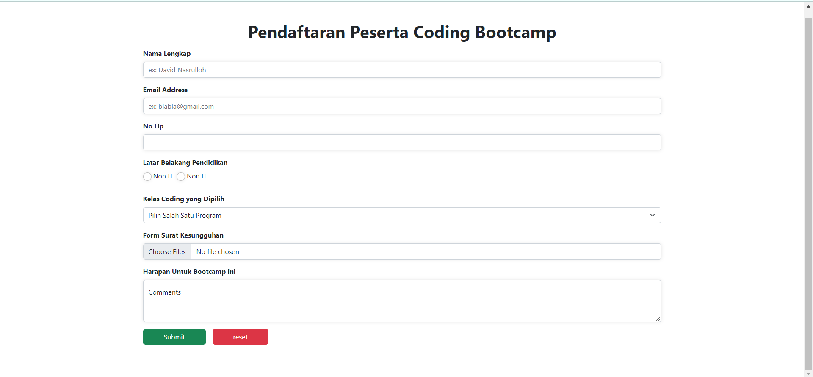

# 16 \_ React Form

```
Nama  : David Nasrulloh
Email : davidkrb52@gmail.com
Univ  : Universitas Trunojoyo Madura
Prodi : Sistem Informasi
```

---

Dalam materi ini, mempelajari:

- Penggunaan Form
- Macam Form
- Apa itu Conctrolled Component
- Tag Textarea
- Tag Select
- Handle Banyak Input
- Apa itu Uncontrolled Component
- Nilai Default
- Tag File Input
- Uncontrolled Component
- Controlled Component
- Apa yang membuat element Controlled
- Kesimpulan
- Kenapa perlu validasi
- Tipe validasi data formulir
- Built-in form validation
- Menggunakan javascript

---

## Resume

---

##### Penggunaan Form

Form meruapakan salah satu hal krusial dalam pengembangan aplikasi website. Form dapat digunakan unruk menghandle inpputan user.
Form banyak kita jumpai saat login, mendaftar sesuatu, memberikan feedback, mengisi data dan masih banyak lainnya.
Dalam react akan ada banyak hal kita pelajari dari Form. Seperti bagaimana menghandle inputan? Bagaimana memvalidasi inputan dsb.

##### Macam Form

1. Elemen input

```
<input name="" />
```

2. Elemen TextArea

```
<textarea name="" />
```

3. Elemen Select

```
<select >
   <option>Pilihan 1</option>
   <option>Pilihan 2</option>
   <option>Pilihan 3</option>
</select >
```

4. Elemen Radio Button

```
<input type="radio">
```

5. Elemen Checkbox

```
<input type="checkbox">
```

6. Type elemen input lainnya
   | Element | Value Property | Element |
   | ------ | ------ | ------ |
   | text(default) | image | submit |
   | button | month | tel |
   | color | number | time |
   | checkbox | password | url |
   | date | radio | week |
   | datetime-local | range |
   | enail | reset | - |
   | file | search | - |
   | hidden | - | - |

##### Apa itu Controlled Component

Sebuah masukan form yang nilainya dikontrol oleh React melalui cara seperti ini disebut sebagai "controlled component"

##### Text Area

Pada react text area menggunakan atribut value. Dengan cara ini, sebuah form yang mengunakan textarea dapat ditulis dengan cara yang sangat mirip dengan sebuah form yang menggunakan input satu baris.

##### Tag select pada HTML vs React

Pada html select membuat sebuah daftar dropdown, DI react, alih-alih menggunakan atribut selected kita menggunakan atribut value di tag select. Hal
Catatan : kita bisa memasukkan array ke atribut value, yang memungkinkan kita memilih beberapa opsi dalam tag select

##### Handle banyak input

Atribut yang membutuhkan penanganan banyak elemen pada controlled component, kita dapat menambahkan atribut name pada setiap elemen dan membiarkan fungsi handler memilih apa yang harus dilakukan berdasarkan nilai dari event.target.name

##### Uncontrolled Component

Uncontrolled component adalah alternatif lain dari contrlled component, dimana data form akan ditangani oleh DOM-nya sendiri. Untuk menulis uncontrolled component, alih-alih menulis event handler untuk setiap pembaruan state, kita bisa menggunakan ref untuk mendapatkan nilai form dari DOM. Karena hal ini, terkadang lebih mudah untuk mengintegrasikan kode React dan non-React jika menggunakan ncontrolled component. Ini berarti lebih sedikit kode jika kita menginginkan solusi cepat walau tak rapi. Selain itu pada umumnya kita harus menggunakan controlled component.

##### Atribut defaultValue

Pada lifecycle rendering React, atribut value pada elemen form akan menimpa nilai pada DOM. Dengan uncontrolled component, sering kali kita ingin React dapat menentukan nilai awal tetapi pembaruan berikutnya dilakukan secara uncontrolled. Untuk menangani kasus ini, kita bisa menggunakan atribut defaultValue alih-alih menggunakan value.

##### Tag File Input

```
Pada HTML, sebuah <input type="file"> memungkinkan pengguna untuk memilih satu atau beberapa file dari media penyimpanan mereka untuk diunggah ke server atau dimanipulasi dengan JavaScript lewat File API.
Dalam React, sebuah <input type="file" /> merupakan uncontrolled component karena nilainya hanya bisa disetel oleh pengguna, bukan oleh kode program.
```

##### Uncontrolled Component?

Input yang tidak terkontrol seperti input formulir HTML tradisional.

```
export default function Form {
    return <div>
        <input type="text"
    </div>
    );
}
```

Kita kemudian bisa mendapatkan nilainya menggunakan ref. Misalnya, di tombol ditambahkan onClickhandler.

##### Uncontrolled Component

Dengan kata lain, kita harus 'menarik' nilai dari field saat kita membutuhkannya. In' bisa terjadi ketika formulir di submit.
Itu adalah cara paling sederhana untuk mengimplementasikan input formulir. Tentu saja ada kasus yang valid untuk menggunakannya: dalam form sederhana dan saat belajar React.
Namun, uncontrolled input tidak powerful. Jadi selanjutnya kita akan mempelajari controlled input.

Controlled Component? Sebuah controlled input menerima nilai saat ini sebagai prop, serta callback untuk mengubah nilai tersebut. Kita bisa mengatakan ini adalah cara yang lebih "React way" untuk pendekatan ini (yang tidak berarti harus selalu menggunakannya).

```
<input value={someValue} onChange={handleChange} />
```

Tetapi nilai input ini harus ada di state yang disimpan di suatu tempat. Biasanya, komponen yang merender input (alias form component) menyimpannya di state-nya. Tentu saja, itu bisa dalam state komponen lain, atau bahkan di penyimpanan state terpisah (separate state store), seperti Redux .

##### Flow Controlled Component

Setiap kali kita mengetik karakter baru, handleNameChange dipanggil. Dibutuhkan nilai baru dari input dan mengaturnya di state.

##### Controlled Component

lni juga berarti bahwa komponen form dapat merespon perubahan input dengan segera, misalnya oleh
• umpan balik di tempat, seperti validasi
• menonaktifkan tombol kecuali semua field memiliki data yang valid
• mengimplementasi format input tertentu, seperti nomor kartu kredit
Tetapi jika tidak memerlukan semua itu dan menganggap uncontrolled lebih sederhana, lakukanlah.

Menjadi 'Controlled' Selain input, ada elemen bentuk lain, seperti checkboxes, radios, selects and textareas. Elemen formulir menjadi "controlled" jika kita menetapkan nilainya melalui prop.
Namun, masing-masing elemen formulir memiliki prop yang berbeda untuk menetapkan nilai itu.

| Element                 | Value Property       | Change Callback | New value in callback |
| ----------------------- | -------------------- | --------------- | --------------------- |
| <input type="text">     | value="string"       | onChange        | event.target.value    |
| <input type="checkbox"> | checked={boolean}    | onChange        | event.taget.checked   |
| <input type="radio">    | checked={boolean}    | onChange        | event.taget.checked   |
| <textarea>              | value="string"       | onChange        | event.taget.value     |
| <select>                | value="option value" | onChange        | event.taget.value     |

##### Kesimpulan

Form controlled dan uncontrolled memiliki kelebihannya sendiri. Kita perlu mengevaluasi situasi kita secara spesifik dan memilih pendekatan apa yang cocok untuk kondisi kita.
Jika formulir sangat sederhana dalam hal umpan batik UI, uncontrolled dengan refs sepenuhnya balk-balk saja. Kita tidak perlu mendengarkan apa yang dikatakan berbagai artikel bahwa uncontrolled itu "buruk". Lagipula kita selalu dapat bermigrasi ke controlled input.

| FItur                                    | uncontrolled | controlled |
| ---------------------------------------- | ------------ | ---------- |
| one-time value retrieval (e.g on submit) | v            | v          |
| validating on submit                     | v            | v          |
| instant field validation                 | x            | v          |
| conditionally disabling submit button    | x            | v          |
| enforcing input format                   | x            | v          |
| several input format                     | x            | v          |
| several inputs for one piece of data     | x            | v          |
| dynamic inputs                           | x            | v          |

##### Kenapa perlu validasi

Buat apa? Pada dasarnya, ada 3 alasan mengapa validasi form diperlukan :

- Mencari input data yang benar dan sesuai format. Sebuah web/aplikasi tidak dapat berjalan dengan benar, jika data yang diolah tidak sesuai dengan kebutuhan aplikasi
- Melindungi akun pengguna. Misalnya, membuat pengguna untuk memasukkan data password yang aman
- Melindungi sistem/aplikasi. Validasi form yang kuat dapat meminimalisir perilaku pengguna yang ingin meretas sistem/aplikasi

##### Tipe validasi data formulir

1. Client-side Validation
   Validasi yang dilakukan pada sisi klien (browser). Validasi ini dilakukan agar data input sesuai dengan kebutuhan form, sebelum data form dikirimkan ke server. Kelebihan validasi sisi klien ialah user-friendly, karena jika terjadi kesalahan pengguna akan langsung diberitahu. Pengguna tidak harus menunggu respon dari server untuk mengetahui hasil validasi.
   Validasi sisi klien, terbagi atas dua bagian • Built-in form validation, yaitu menggunakan fitur validasi langsung dari HTML5. Biasanya, validasi ini tidak membutuhkan Javascript dan memiliki performa yang lebih balk. Tapi tidak dapat dikostumisasi. Kadang pesan errornya cukup `kaku'. Contohnya : required, minlength, maxlength, min, max, type dan patten • Menggunakan Javascript. In' membuat validasi form dapat dikostumisasi. Tetapi kita perlu membuatnya sendiri.
2. Server-side validation
   Validasi yang dilakukan pada sisi server. Sisi server bertugas untuk memvalidasi data kembali, sebelum disimpan di database. Jika ditemukan kesalahan, maka response akan dikirim kembali ke client berupa koreksi atas kesalahan yang dibuat oleh pengguna.
   Berbeda dengan validasi sisi klien, validasi ini tidak user-friendly. Karena, koreksi kesalahan akan dikirimkan, setelah form di-submit.

Catatan :
Javascript bisa kapan? Bisa kapan saja melakukan validasi? • Ketika ada perubahan di form. Ketika ada perubahan, akan mentrigger event onChange. Kkup real-time berdasarkan perubahan data, namun fungsi akaelebihannya validasi akan can terus dipanggil selama ada perubahan. Bisa dikombinasikan dengan disable button. • Ketika menekan tombol submit. Ketika menekan tombol submit, akan mentrigger event onSubmit. Kelebihannya validasi cukup sekali, namun tidak akan real-time memvalidasi form.

---

### output praktikum:

##### Tampilan Normal



##### Tampilan Error Nama


##### Tampilan Error Email


##### Tampilan Error No Hp


##### Tampilan Berhasil


Catatan : Ketika ada error button disabled / atau tidak bisa di klik

##### Tampilan Disable Button


---

24 September 2022 | David Nasrulloh
