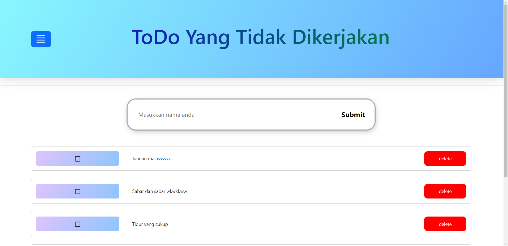
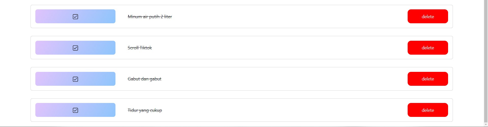

# 17 \_ React Redux

```
Nama  : David Nasrulloh
Email : davidkrb52@gmail.com
Univ  : Universitas Trunojoyo Madura
Prodi : Sistem Informasi
```

---

Dalam materi ini, mempelajari:

- Global State Manajemen
- Redux Thunk
- Menyimpan State ke storage
- Introduction Hasura
- Postman
- Instalation
- Implementation RESTAPI at React Js

---

## Resume

---

##### Kapan saat yang tepat untuk menggunakan Redux

1. Banyak state yang perlu di taruh dibanyak tempat
2. State pada app sering berubah
3. Logic untuk mengubah state kompleks
4. Ukuran codebase yang sedang besar, dan dikerjakan oleh banyak orang
5. Perlu untuk mengetahui bagaimana state diupdate seiring dengan waktu

##### Redux Library dan Tools

1. React-Redux
2. Redux Toolkit
3. Redux DevTools Extension

##### Redux Library dan Tools

1. Actions
2. Reducer
3. Store

##### Memakai dan mengubah state

1. Hooks
2. Connect

##### Redux Thunk

Thunk Middleware untuk redux yang memungkinkan kita untuk membuat action creator yang mengembalikan function bukan action

##### Kenapa perlu Redux Thunk

Untuk menghandle side effect logic seperti logic synchronous kompleks yang perlu mengakses store dan juga logic async seperti request data

##### Menyimpan State ke storage

perlu isntall github.com/rt2zz/redux-persist

```
npm install redux-persist
```

##### What is Hasura ?

The Hasura GraphQL Engine is a blazing fast GraphQL server that gives you instant, realtime GraphQL APIs over Postgres, with webhook triggers on database events, and remote schemas for bussiness logic.

##### What is Postman ?

Postman is an API platform for developers to design, build, test and iterate their APIs

##### Why use POSTMAN

- Easy for collaborate with auto sync with other member
- Simple interface
- POSTMAN is free upto 3 member and unlimited collection

##### Install Axios

```
npm install axios
```

##### Rangkuman

Catatan :

1. Redux adalah library untuk manajemen state global
2. Redux menggunakan struktur "one-way data flow"
3. Redux menggunakan beberapa tipe code

---

### output praktikum:

##### Tampilan Normal Dengan Tambah Task dan Delete Task



##### Tampilan Dengan Task Checked



---

07 Oktober 2022 | David Nasrulloh
