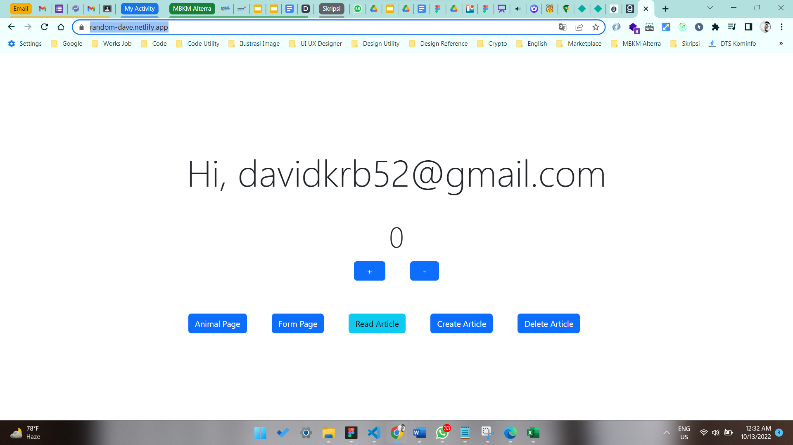

# 19 \_ Deployment

```
Nama  : David Nasrulloh
Email : davidkrb52@gmail.com
Univ  : Universitas Trunojoyo Madura
Prodi : Sistem Informasi
```

---

Dalam materi ini, mempelajari:

- Kenapa perlu build
- Build menggunakan react App
- Run Optimized App
- Apa itu Deployment?
- Deployment dengan Surge
- Deployment dengan Netlify CLI

---

## Resume

---

##### Kenapa perlu build ?

Secara default, React mengandung banyak pesan peringatan. Peringatan-peringatan ini sangat berguna dalam pengembangan aplikasi. Namun, pesan-pesan ini membuat React menjadi lebih besar dan lambat. Oleh karenanya kita harus menggunakan versi produksi ketika men-deploy aplikasi.
Tujuan melakukan build agar aplikasi kita menjadi versi production, sehingga performanya lebih ringan cepat.

##### Build React APP

Karena proyek kita dibangun menggunakan Create React App,

```
npm run build
```

Ini akan membuat versi produksi untuk aplikasi kita di dalam folder build/. lni hanya diperlukan sebelum men-deploy ke produksi. Untuk pengembangan normal, gunakan npm start.

##### Run Optimized App

Install Serve

```
npm install -g serve
```

Jalankan serve di lokal

```
serve -s build
```

##### Apa itu Deployment

Deployment adalah kegiatan yang bertujuan untuk menyebarkan aplikasi yang sudah kita buat. Harapannya aplikasi tersebut dapat diakses oleh banyak orang, tidak hanya oleh kita sendiri.

##### Deployment dengan Surge

Surge adalah layanan penerbit website statik (static web publishing) gratis untuk Front-End Developers. Website statik yang menggunakan surge akan memiliki subdomain \*.surge.sh. Surge dapat menerima file HTML, CSS, dan JS.

##### Install Surge

1. Pastikan menggunakan versi Node yang terbaru
2. Install Surge di terminal

```
npm install --global surge
```

Teardown Surge, Terkadang kita tidak ingin mempublikasikan sebagian domain atau subdomain. Untuk itu kita bisa teardown sebuah project melalui surge CLI. Ini efektif membuat proyek kita offline.

```
surge teardown vancouver.surge.sh
```

##### Deployment dengan Netlify CLI

Apa itu Netlify? Netlify adalah salah satu platform penyedia layanan build tools sekaligus Continous Deployment. Netlify memungkinkan kita untuk mempublish website statis secara gratis. Netlify juga sudah terintegrasi dengan Git Host popular seperti Github, Gitlab dan Bitbucket.

##### Deploy dengan Netlify

1. Buat akun Netlify (www.netlify.com)
2. Install Netlify CLI di terminal

```
npm install netlify-cli -g
```

3. jalankan perintah netlify deploy di terminal
4. Verify akun melalui browser, pilih Authorize
5. Pilih "Create & Configure a new site"
6. Pilih lokasi file yang akan dideploy Pilih /build

##### Link Hasil Deployment

https://random-dave.netlify.app/

---

### output praktikum:

##### Tampilan Hasil Deployment dengan Netlify




---

12 Oktober 2022 | David Nasrulloh
