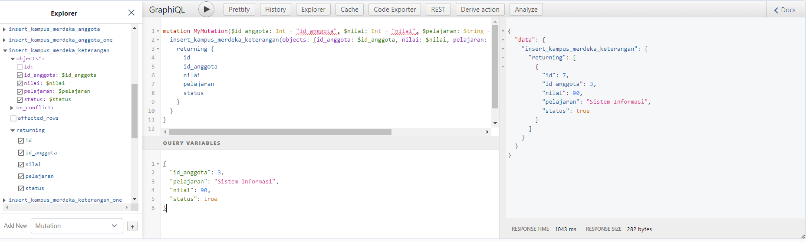
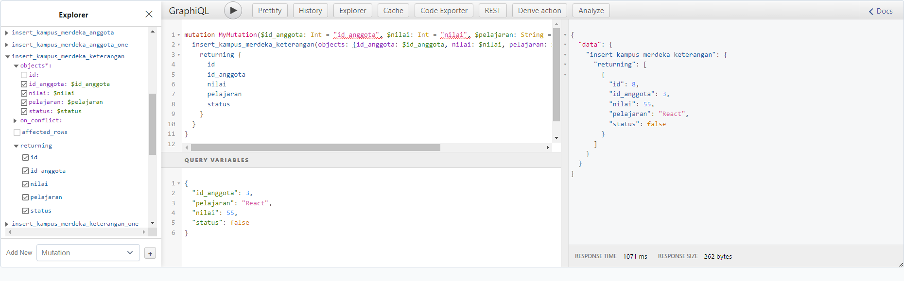

# 20 \_ GraphQL

```
Nama  : David Nasrulloh
Email : davidkrb52@gmail.com
Univ  : Universitas Trunojoyo Madura
Prodi : Sistem Informasi
```

---

Dalam materi ini, mempelajari:

- GraphQL Overview
- Hasura & Heroku
- Apollo Setup
- Query
- Mutation
- Subscription

---

## Resume

---

##### Apa itu GrpahQL

GraphQL is a query language for your API, and a server-side runtime for executing queries by using a type system you define for your data. GraphQL minimizes the amount of data that needs to be transferred over the network. With graphQL we can use one single endpoint ( /graphQL ) for any requests needed.

##### GrpahQL Core Feature

Before we can do GraphQL then we need to setup GraphQL Server (Backend), you can use Hasura, Apollo Server or others to do that. Then we can use GraphQL on client either using Prisma, Apollo Client, Postman, etc.

There are 3 main features in GraphQL client:

1. Query, get data based on specific query that we define
2. Mutation, insert, update, delete data
3. Subscription, get updated date realtime / based on events

##### Query Basic

With graphQL we can get data exactly what we need. We define what fields that we want to get and graphQL will give us data based on what we define. For example, imagine there is one collection in database that holds movies data. All unneeded data like director, created_at and updated_at can will not be included in the result.

##### Query Multiple related data source / Collections

We can also use query to get data from multiple related collections. In the example below, if we want to get director data we need to use director.id to get data from other endpoint, but with graphql we can also define needed fields directly as long as it’s available on GraphQL server.

##### Query Multiple unrelated data source / Collections

We can also use query to get data from multiple unrelated collections for minimizing network request. Image if we want movies data and books data. With REST we need to do at least 2 request to 2 different endpoints. With GraphQL we can do 1 request to get those data.

##### Query Fragment

A GraphQL fragment is a piece of logic that can be shared between multiple queries and mutations. We can use fragment to simplify query or mutation

##### Mutation

Mutation is basically functionality to update, insert and delete data. We need to define what operation that we want to do (based on available operation on your graphql server) and then define what data GraphQL need to return.

##### Subcription

Subscriptions are a GraphQL feature that allows a server to send data to its clients when a specific event happens. Subscriptions are usually implemented with WebSockets. In that setup, the server maintains a steady connection to its subscribed client.
When data is modified then client will get updated data directly in real-time. In example below, if we do subscription on person collection then everytime new person is added or when data is deleted or modified then we will get updated data real-time directly to our client. Subscription will only happen on client side not server side.

##### Hasura & Heroku

1. Pastikan menggunakan versi Node yang terbaru
2. Install Surge di terminal

Hasura is a service provide graphql and rest api. Full managed on hasura cloud or self-hosted. Open https://hasura.io/ and create new your own graphql server

Heroku is a cloud platform as a service supporting several programming languages. Heroku also provide free postgres database. Open https://heroku.com/ and create your own service

##### Setting hasura and heroku

After finish register hasura and heroku, open hasuran and create new project. When finish launch console and setting database server. Click tab data and create heroku database. When it’s done create database, you can configure your database.

##### Apollo Setup

Apollo Client is a comprehensive state management library for JavaScript that enables us to manage both local and remote data with GraphQL. Use it to fetch, cache, and modify application data, all while automatically updating UI. The core @apollo/client library provides built-in integration with React. We an use Apollo client to do any GraphQL operations (query, mutation and subscription) inside our React or Next JS app. Apollo client works well with any GraphQL server (Hasura, Apollo Server, etc)

##### Apollo Client Next JS Setup - Installation

1. Create new React JS project

```
npx create-react-app react-graphql
```

2. Install GraphQL and apollo client

```
yarn add graphql @apollo/client
```

3. Don’t forget to commit changes to track progress

##### Query with Apollo Client - lazy query

When React renders a component that calls useQuery, Apollo Client automatically executes the corresponding query. But what if you want to execute a query in response to a different event, such as a user clicking a button?
The useLazyQuery hook is perfect for executing queries in response to events besides component rendering. Unlike with useQuery, when you call useLazyQuery, it does not immediately execute its associated query. Instead, it returns a query function in its result tuple that you call whenever you're ready to execute the query.

##### Query with Apollo Client - refetching

Refetching enables you to refresh query results in response to a particular user action, as opposed to using a fixed interval. You can optionally provide a new variables object to the refetch function. If you don't, the query uses the same variables that it used in its previous execution.

##### Subscription

1. Install subscriptions-transport-ws to enable websocket connection

```
yarn add @apollo/client subscriptions-transport-ws
```

2. Import all needed modules and separate between http and websocket link
3. Create httpLink for query and mutation. And wsLink for subscription. Add header for authentication. Get this link from your hasura console. WsLink use wss:// instead of https:// because wsLink use websocket.. Note that wss is more secure than ws, just like https is more secure than http.
4. Add split function and use as link when create client. Split function used to combine those two Links into a single Link that uses one or the other according to the type of operation being executed . When operation is equal subscription then use wsLink, if not then use httpLink for query and mutation
5. Import useSubscription from apollo client and define subscription
6. Invoke subscription and consume data, in this example we will remove query from previous code and change it to subscription. In jsx code just like before

##### Subscription using subscribeToMore

subscribeToMore is a function that enables you to execute a subscription, usually to subscribe to specific fields that were included in the query. Or when server return only 1 updated data instead of all data, then we need to update previous data in prev variable and return updated data

---

### output praktikum:

##### Tampilan Hasil Query


##### Tampilan Hasil Insert 1



##### Tampilan Hasil Insert 2



##### Tampilan Hasil Update dari False ke True


---

15 Oktober 2022 | David Nasrulloh
