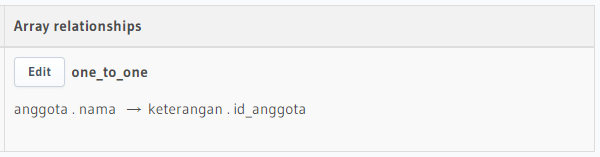
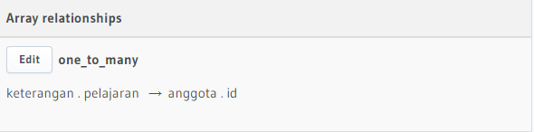

# 20 \_ GraphQL Relational Database

```
Nama  : David Nasrulloh
Email : davidkrb52@gmail.com
Univ  : Universitas Trunojoyo Madura
Prodi : Sistem Informasi
```

---

Dalam materi ini, mempelajari:

- Introduction Database
- Relational Database
- Entity Relationship Diagram
- SQL Statement

---

## Resume

---

##### Jenis Database Relationship

- One To One
  Contoh = satu user hanya memiliki 1 foto profil
- One To Many
  Contoh = satu user bisa memiliki banyak tweets
- Many To Many
  Contoh = satu user bisa memiliki banyak follower user, 1 user bisa di follow banyak user
  Contoh = 1 mahasiswa bisa memiliki banyak mata kuliah, 1 mata kuliah bisa oleh banyak mahasiswa

##### Relational Database Management System

Software untuk memanage database contoh software RDBMS adalah MySQL

Jenis - jenis perintah SQL

1. Data Definition Language
2. Data Manipulation Language
3. Data Control Language

##### DDL Statement

CREATE DATABASE database_name;
USE database_name;
CREATE TABLE ...
DROP TABLE ...
RENAME TABLE ...

##### Create Table With Is Schema

CREATE TABLE table name( column1 data type PRIMARY KEY, column2 data type FOREIGN KEY,
column data type, PRIMARY KEY( one or more columns ) );

##### Modify Table Schema

ALTER TABLE table name
ADD COLUMN column name data type;

##### Tipe Data MySQL

- NUM
- Huruf
- Date

##### DML Data Manipulation Language

Statement Operation

- Insert
- Select
- Update
- Delete

##### DML Statement

- Like / Beetween
- And / Or
- Order By
- Limit

##### Join

Sebuah klausa untuk mengkombinasikan record diri dua atau tabel
Join Standar SQL Ansi

1. Inner
   Inner Join akan mengembalikan baris-baris dari dua tabel atau lebih yang memenuhi syarat
2. Left
   Left Join akan mengembalikan seluruh baris dari tabel disebelah kiri yang dikenai kondisi ON dan hanya baris dari tabel disebelah kanan yang memenuhi kondisi join
3. Right
   Right Join akan mengembalikan semua baris dari tabel sebelah kanan yang dikenai kondisi ON dengan data dari tabel sebelah kiri yang memenuhi kondisi join. Teknik ini merupakan kebalikan dari left join.

##### Union

Hal yang perlu diperhatikan dari union adalah jumlah field yang dikeluarkan / dipanggil harus sama

##### Aggregate

Fungsi di mana nilai beberapa baris dikelompokkan bersama untuk membentuk nilai ringkasan tunggal

##### Fungsi Agregasi SQL

- Min
  fungsi di mana nilai beberapa baris dikelompokkan bersama untuk membentuk nilai ringkasan tunggal.

```
SELECT MIN(id) AS id FROM users
SELECT MIN(created_at) AS created FROM users
```

- Max
  Digunakan untuk mendapatkan nilai maximum atau nilai terbesar dari sebuah data record di tabel.

```
SELECT MAX(id) FROM users
SELECT MAX(created_at) FROM users
```

- SUM
  Digunakan untuk mendapatkan jumlah total nilai dari sebuah data atau record di tabel.

```
SELECT SUM favourite_count FROM tweets WHERE user_id-1
```

- AVG
  AVG Digunakan untuk mencari nilai rata-rata (average) dari sebuah data atau record di tabel.

```
SELECT AVG(favourite_count) FROM tweets WHERE user_id=1
```

- COUNT
  COUNT Digunakan untuk mencari jumlah dari sebuah data atau record di tabel.

```
SELECT COUNT(1) FROM tweets WHERE user_id=1
```

- HAVING
  Digunakan untuk menyeleksi data berdasarkan kriteria tertentu, dimana kriteria berupa fungsi aggregat.

```
SELECT user_id FROM tweets GROUP BY user_id HAVING SUM(favourite_count): 2
```

##### SubQuerry

Subquery atau Inner cuery atau Nested query acalah query di dalam query SQL lain
SEBUAH SUBQUERY digunakan untuk mengembalikan data yang akan digunakan dalam query utama sebagai syarat untuk Iebih membatasi data yang akan diambil.
SUBQUERY DAPAT DIGUNAKAN dengan SELECT, INSERT, UPDATE, dan DELETE statements bersama dengan operator seperti IN, BEETWEEN dll

PERATURAN
• Harus tertutup dalam tanda kurung.
• Sebuah subquery hanya dapat memiliki satu kolom pada klausa SELECT, kecuali beberapa kolom yang di query utama untuk subquery untuk membandingkan kolom yang dipilih.
• Subqueries yang kembali lebih dari satu baris hanya dapat digunakan dengan beberapa value operator, seperti operator IN.
• Daftar SELECT tidak bisa menyertakan referensi ke nilai-nilai yang mengevaluasi ke BLOB, ARRAY, CLOB, atau NCLOB.
• Sebuah subquery tidak dapat segera tertutup dalam fungsi set.

##### Query with Apollo Client - lazy query

When React renders a component that calls useQuery, Apollo Client automatically executes the corresponding query. But what if you want to execute a query in response to a different event, such as a user clicking a button?
The useLazyQuery hook is perfect for executing queries in response to events besides component rendering. Unlike with useQuery, when you call useLazyQuery, it does not immediately execute its associated query. Instead, it returns a query function in its result tuple that you call whenever you're ready to execute the query.

##### Function

FUNCTION sebuah kumpulan statement yang akan mengembalikan sebuah nilai balik pada pemanggilnya

---

### output praktikum:

##### On To One



##### On To Many



---

18 Oktober 2022 | David Nasrulloh
