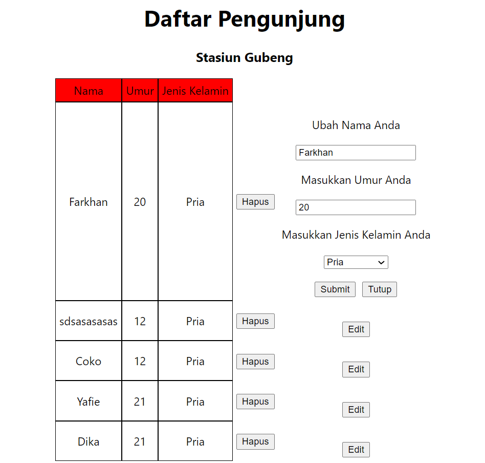

# 22_GraphQL – Mutation

```
Nama  : David Nasrulloh
Email : davidkrb52@gmail.com
Univ  : Universitas Trunojoyo Madura
Prodi : Sistem Informasi
```

---

Dalam materi ini, mempelajari:

- GraphQL Overview
- Hasura & Heroku
- Apollo setup
- Query
- Mutation
- Subscription

---

## Resume

---

##### Mutation

Mutation is basically functionality to update, insert and delete data. We need to define what operation that we want to do (based on available operation on your graphql server) and then define what data GraphQL need to return.

##### Component Mutation

1. Insert
2. Update
3. Delete

---

### output praktikum:

##### Hapus


##### Tambah


##### Update



---

23 Oktober 2022 | David Nasrulloh
