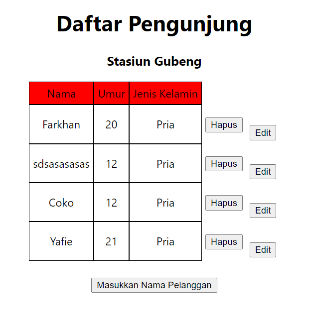
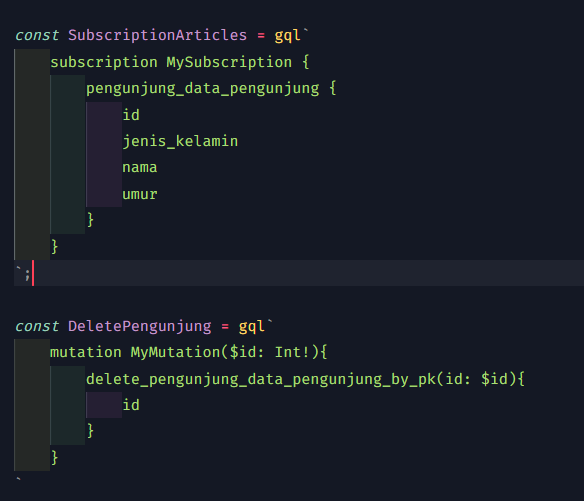
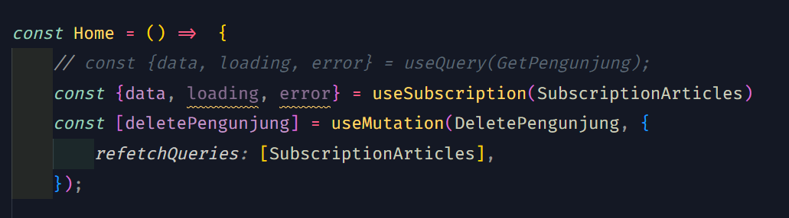

# 23_GraphQL – Subscription

```
Nama  : David Nasrulloh
Email : davidkrb52@gmail.com
Univ  : Universitas Trunojoyo Madura
Prodi : Sistem Informasi
```

---

Dalam materi ini, mempelajari:

- GraphQL Overview
- Hasura & Heroku
- Apollo setup
- Query
- Mutation
- Subscription

---

## Resume

---

##### Subscription

Subscriptions are a GraphQL feature that allows a server to send data to its clients when a specific event happens. Subscriptions are usually implemented with WebSockets. In that setup, the server maintains a steady connection to its subscribed client.
When data is modified then client will get updated data directly in real-time. In example below, if we do subscription on person collection then everytime new person is added or when data is deleted or modified then we will get updated data real-time directly to our client. Subscription will only happen on client side not server side.

##### What is Hasura & Heroku

Hasura is a service provide graphql and rest api. Full managed on hasura cloud or self-hosted. Open https://hasura.io/ and create new your own graphql server
Heroku is a cloud platform as a service supporting several programming languages. Heroku also provide free postgres database. Open https://heroku.com/ and create your own service

##### Setting hasura and heroku

After finish register hasura and heroku, open hasuran and create new project. When finish launch console and setting database server. Click tab data and create heroku database. When it’s done create database, you can configure your database.

##### Apollo Setup

Apollo Client is a comprehensive state management library for JavaScript that enables us to manage both local and remote data with GraphQL. Use it to fetch, cache, and modify application data, all while automatically updating UI. The core @apollo/client library provides built-in integration with React. We an use Apollo client to do any GraphQL operations (query, mutation and subscription) inside our React or Next JS app. Apollo client works well with any GraphQL server (Hasura, Apollo Server, etc)

##### Apollo Client Next JS Setup - Installation

1. Create new React JS project

```
npx create-react-app react-graphql
```

2. Install GraphQL and apollo client

```
yarn add graphql @apollo/client
```

3. Don’t forget to commit changes to track progress

##### Query with Apollo Client - lazy query

When React renders a component that calls useQuery, Apollo Client automatically executes the corresponding query. But what if you want to execute a query in response to a different event, such as a user clicking a button?
The useLazyQuery hook is perfect for executing queries in response to events besides component rendering. Unlike with useQuery, when you call useLazyQuery, it does not immediately execute its associated query. Instead, it returns a query function in its result tuple that you call whenever you're ready to execute the query.

##### Query with Apollo Client - refetching

Refetching enables you to refresh query results in response to a particular user action, as opposed to using a fixed interval. You can optionally provide a new variables object to the refetch function. If you don't, the query uses the same variables that it used in its previous execution.

##### Subscription using subscribeToMore

subscribeToMore is a function that enables you to execute a subscription, usually to subscribe to specific fields that were included in the query. Or when server return only 1 updated data instead of all data, then we need to update previous data in prev variable and return updated data

---

### output praktikum:

##### Hasil yang udah jalan dengan mantap



##### Code 1



##### Code 2



---

24 Oktober 2022 | David Nasrulloh
