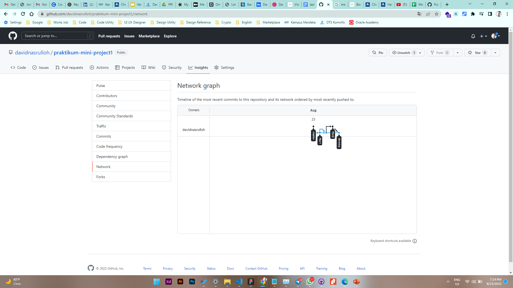

# 3 \_ Version Control and Branch Management (Git)

```sh
Nama  : David Nasrulloh
Email : davidkrb52@gmail.com
Univ  : Universitas Trunojoyo Madura
Prodi : Sistem Informasi
```

---

Dalam materi ini, mempelajari:

- Apa yang dimaksud dengan git versioning
- Setting git
- Saving changes (Git status, add, commit, diff, stash, ignore)
- Git log checkout dan reset
- Syncing (Remote, Fetch, Push dan Pull)
- Belajar mengenai branch
- Pull Request
- Serta penjelasan mengenai collaboration

---

## Resume

---

##### Apa yang dimaksud dengan versioning ?

mengatur versi dari source code program

##### Apa itu Git ?

Salah satu version control system populer yang digunakan para developer untuk mengembangkan software secara bersama-bersama

##### Hal yang harus diperhatikan ketika Collaboration

The best way nya untuk susunan branch adalah

1. Master (hanya untuk production)
2. Branch develop (ketika development)
3. Dari develop buat branch baru seperti fitur a
4. Dari develop buat branch baru seperti fitur b

##### Code git yang penting untuk diingat

Salah satu version control system populer yang digunakan para developer untuk mengembangkan software secara bersama-bersama

###### GIT INIT, CLONE, CONFIG

```
# git config
$ git config --global user.name “John Done”
$ git config --global user.email “johndoe@email.com”

# start with init
$ git init
$ git remote add <remote_name> <remote_repo_url>$ git push -u <remote_name> <local_branch_name>

# start with existing project, start working on the project
$ git clone ssh://john@example.com/path/to/my-project.git
$ cd my-project
```

###### GIT DIFF AND STASH

```
# git diff
# change file
# add staging area
$ git diff --staged

# stashing your work
$ git stash

# re-applying your stashed changes
$ git stash apply
```

###### GIT LOG, CHECKOUT

```
# viewing an old revision
$ git log --oneline

# b7119f2 Continue doing crazy things
# 872fa7e Try something crazy
# a1e8fb5 Make some important changes to hello.txt

$ git checkout a1e8fb5
```

###### GIT PUSH, FETCH & PULL

```
# git remote
$ git remote -v
$ git remote add origin http://dev.example.com/john.git

# fetch and pull
$ git fetch
$ git pull origin master

# push
$ git push origin master
$ git push origin feature/login-user
```

###### GIT BRANCHING

```
# show all branch
$ git branch --list

# create a new branch called <branch>
$ git branch <branch>

# force delete the specified branch
$ git branch -D <branch>

# list remote branch
$ git branch -a
```

###### GIT MERGE

```
# Start a new feature
$ git checkout -b new-feature master
# Edit some files
$ git add <file>
$ git commit -m "Start a feature"
# Edit some files
$ git add <file>
$ git commit -m "Finish a feature"
# Merge in the new-feature branch
$ git checkout master
$ git merge new-feature
$ git branch -d new-feature
```

---

### output praktikum:


