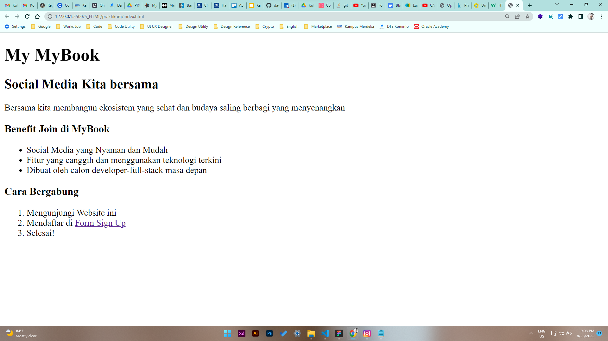
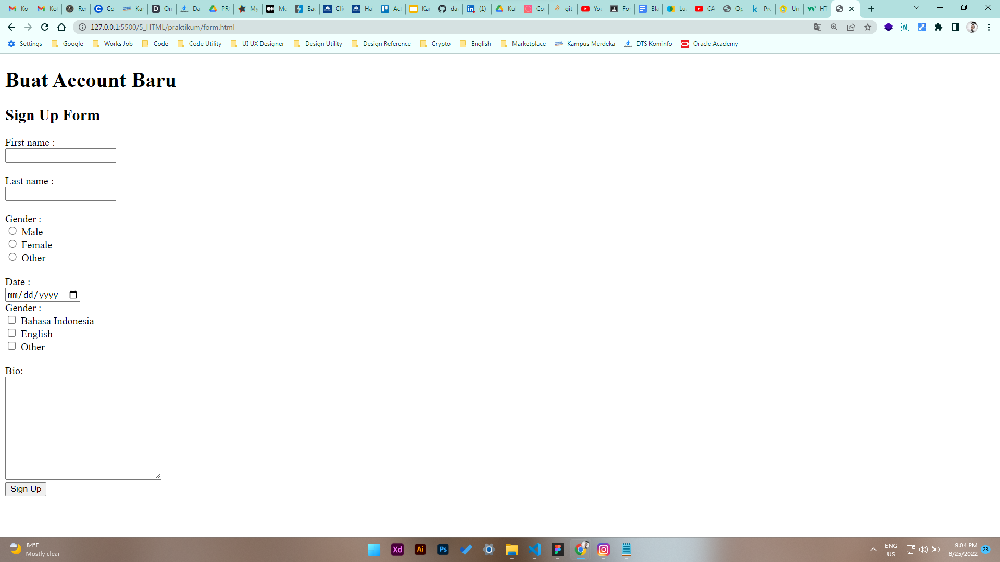
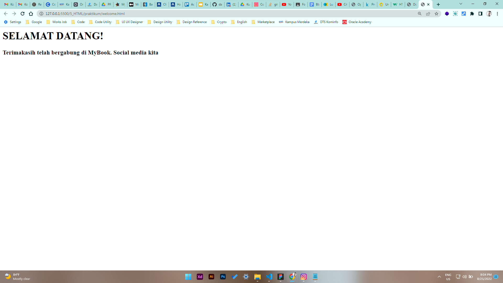

# 5 \_ HTML

```sh
Nama  : David Nasrulloh
Email : davidkrb52@gmail.com
Univ  : Universitas Trunojoyo Madura
Prodi : Sistem Informasi
```

---

Dalam materi ini, mempelajari:

- Pengertian HTML
- Kegunaan HTML
- HTML Editor
- Struktur halaman pada file HTML
- Elemen dan tag yang ada pada HTML

---

## Resume

---

##### Apa itu HTMl ?

HTML (Hypertext Markup Language) adalah sebuah standar yang digunakan secara luas untuk menampilkan halaman web.

##### Kagunaan HTML ?

- Membuat struktur dari halaman website
- Mengatur tampilan dan isi dari halaman web
- Membuat tabel dengan tag HTML table
- Membuat form HTML.
- Membuat gambar dengan canvas
- Membuat gambar dengan canvas
- Mempublikasikan halaman website secara online

##### Struktur utama HTML

```
<!DOCTYPE html>
<html lang="en">
<head>
    <meta charset="UTF-8">
    <meta http-equiv="X-UA-Compatible" content="IE=edge">
    <meta name="viewport" content="width=device-width, initial-scale=1.0">
    <title>Document</title>
</head>
<body>
    (ini difungsikan untuk mengisi content)
</body>
</html>
```

##### Catatan penting

```
* tag <div> untuk mengisi content HTML yang dimiliki
* tag heading menggunakan <h1> sampai dengan <h6>
* bisa menggunakan styling pada html seperti
* 1. <strong> membuat text lebih tebal
* 2. <em> penekanan pada text menjadi italic
* 3. <s> membuat text dengan garis tercoret
* 4. <br> line break, untuk membuat garis baru

Pada tag yang ada di html dapat diisikan dengan atribut dan style yang disesuaikan dengan kebutuhan, seperti tag a dapat diisi tag atribut href untuk melinkan ke link yang akan dituju
Contoh tag yang ada pada html
* 1. <a> tag a berfungsi untuk hyperlink
* 2.  tag img berfungsi untuk menambahkan gambar kedalam sebuah website
* 3. <ol> list terurut, <ul> list tidak terurut dan didalam kedua tag tersebut terdapat tag <li> list item yang berfungsi untuk mengisikan items yang ada pada tag <ol> dan <ul>
* Catatan : setiap tag memiliki atribut dengan value yang berbeda beda, berbeda kegunaan dan tujuannya

Tag yang ada pada tabel yaitu
* <table> tag yang berfungsi untuk membuat table pada HTML
* <tr> untuk mendeklarasikan setiap baris table
* <td> mendeklarasikan setiap kolom table
* <th> untuk kolom pada table header
```

---

### output praktikum:

##### index page



##### form page



##### welcome page



---

25 Agustus 2022
