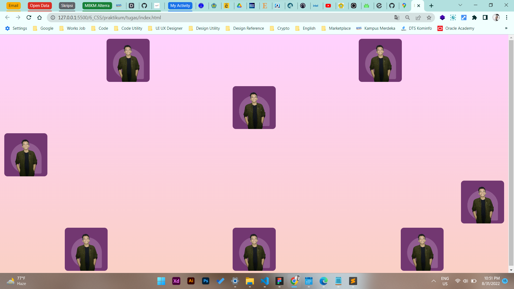
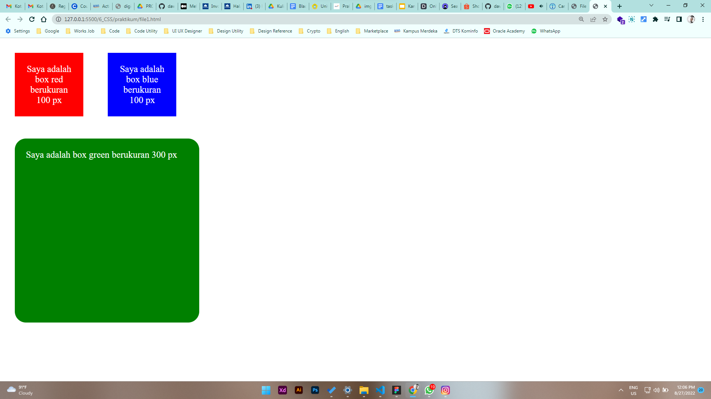
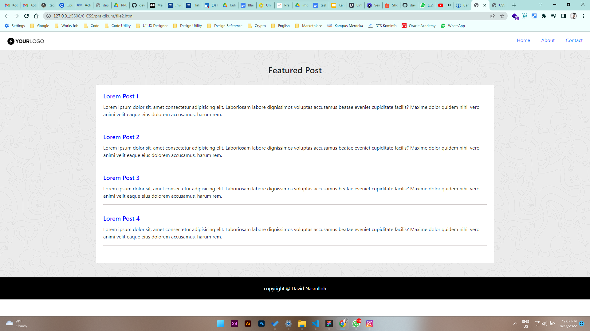

# 6 \_ CSS

```sh
Nama  : David Nasrulloh
Email : davidkrb52@gmail.com
Univ  : Universitas Trunojoyo Madura
Prodi : Sistem Informasi
```

---

Dalam materi ini, mempelajari:

- Cara menambahkan file CSS
- CSS Selector
- CSS Grouping
- CSS Font
- CSS Margin dan Padding
- CSS Backgroung
- CSS Link Event
- CSS Display
- CSS Table
- CSS Framework (Bootstrap)
- Penjelasan mengenai bootstrap dan penggunaan nya

---

## Resume

---

##### Apa itu CSS dan Frontend Framework? Bootstrap ?

CSS berfungsi untuk memperindah tampilan sebuah website agar lebih menarik dan enak dipandang.
Front End Framework adalah sekumpulan aturan kode ynag bisa kita gunakan untuk mempermudah dalam membuat suatu tampilan website, salah satunya adalah boorstrap.
Alasan menggunakan bootstrap adalah dapat diakses secara gratis, mudah dipelajari, cepat dan mendukung responsif pada website

##### Menambahkan file CSS

3 Cara menambahkan file CSS ke dalam HTML :

```
1. External CSS (membuat file baru bernama CSS)
2. Internal CSS (di dalam tag head dengan membuat tag baru yaitu <style>)
3. Inline CSS (didalam tag html)
```

##### CSS Selector

1. ID -> (#)
2. Class -> (.)

##### CSS Grouping

contoh

```
h1,
h2,
judul,
#nama {
	color: blue;
}
```

##### CSS Font Properties

| Properties  | Penjelasan                                          |
| ----------- | --------------------------------------------------- |
| Font        | Menetapkan semua properti font dalam satu deklarasi |
| Font-family | Menentukan kelompok font teks                       |
| Font-size   | Menentukan ukuran font teks                         |
| Font-weight | Menentukan ketebalan untuk font teks                |
| Font-style  | Menentukan font teks menjadi miring                 |

##### CSS Margin dan Padding

Contoh CSS margin dan padding

```
header {
    padding: 4px 24px;
    margin: 20px;
}
```

##### Background

| Properties          | Penjelasan                                     |
| ------------------- | ---------------------------------------------- |
| Background-color    | Menetapkan warna background pada suatu elemen  |
| Background-image    | Menentukan gambar background pada suatu elemen |
| Background-repeat   | Menentukan gambar background untuk di ulang    |
| Background-size     | Menentukan ukuran gambar untuk background      |
| Background-position | Mengatur posisi awal gambar background         |

contoh

```
.judul {
    background-image: url(../img/sample-pattern.png);
    background-position: right top;
    background-repeat: no-repeat;
    background-color: #red;
    background-size: 100%;
}
```

##### CSS Link Event

| Properties | Penjelasan                                            |
| ---------- | ----------------------------------------------------- |
| :hover     | Kondisi style ketika mouse berada diatas elemen       |
| :active    | Style ketika link "a" ditekan                         |
| :visited   | Style dimana elemen link "a" telah dikunjungi di klik |

##### CSS Display

| Properties   | Penjelasan                                                               |
| ------------ | ------------------------------------------------------------------------ |
| block        | Elemen block selalu dimulai pada baris baru (dimulai dari kiri ke kanan) |
| inline-block | Elemen inline-block membutuhkan lebar sesuai yang diperlukan             |
| none         | menyembunyikan elemen untuk tidak ditampilkan                            |

##### CSS Table

| Properties       | Penjelasan                                |
| ---------------- | ----------------------------------------- |
| border           | menambahkan border pada table, th, dan td |
| border-collapse  | membuat border menjadi single border      |
| :nth-child(even) | membuat background stripe                 |

##### Catatan penting

Resource untuk memperdalam HTML dan CSS dasar
Fonts - https://fonts.google.com/
W3School css - https://www.w3schools.com/css/
Box Shadow css - https://www.cssmatic.com/box-shadow
Gradient css - https://www.cssmatic.com/gradient-generator
Color Picker - https://www.w3schools.com/colors/colors_picker.asp

```
# Catatan
Clas dan properti pada framework bootstrap ada pada halaman dokumentasi Bootstrap
https://getbootstrap.com/docs/5.0/getting-started/introduction/
```

### output tugas (challenge):

##### Tugas Membuat Layouting menggunakan Flexbox



### output praktikum:

##### File 1



##### File 2



---

27 Agustus 2022
