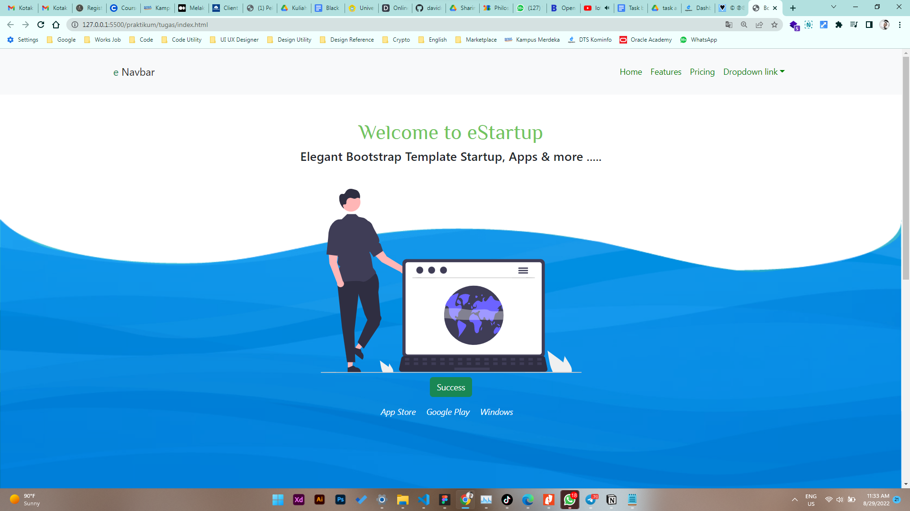
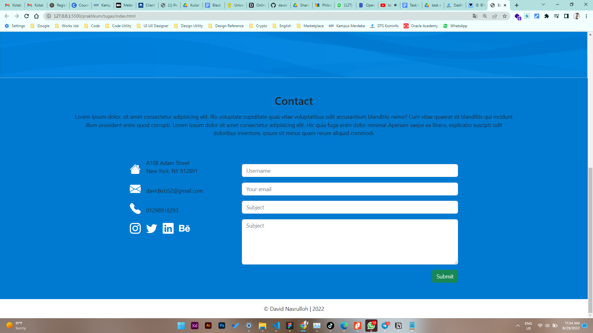
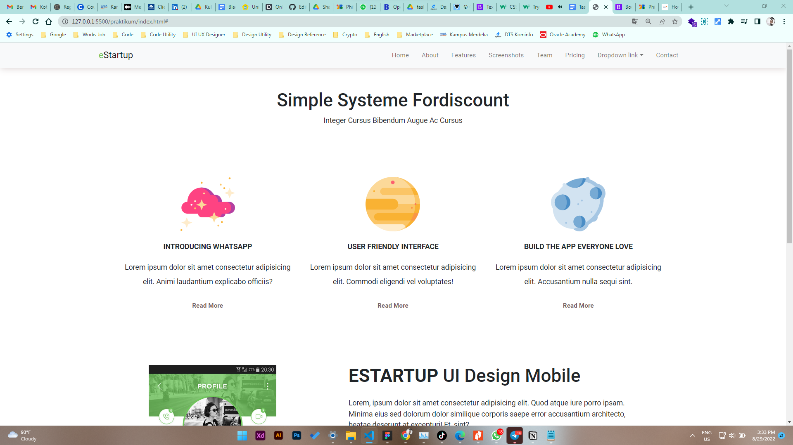
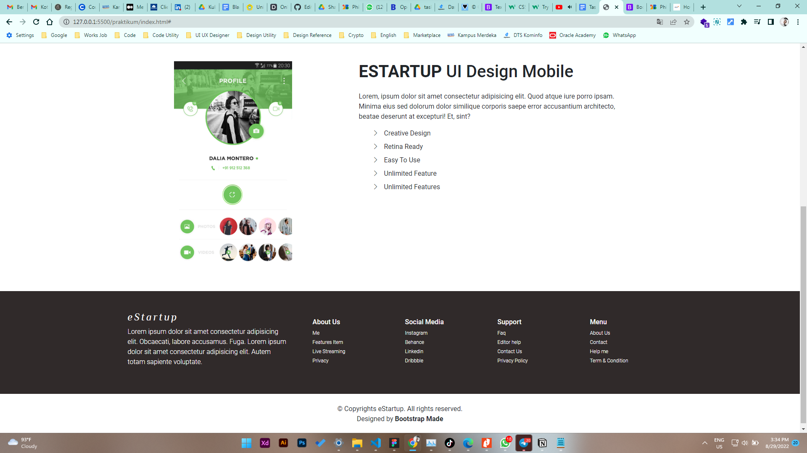

# 7 \_ Bootstrap

```sh
Nama  : David Nasrulloh
Email : davidkrb52@gmail.com
Univ  : Universitas Trunojoyo Madura
Prodi : Sistem Informasi
```

---

Dalam materi ini, mempelajari:

- Cara menggunakan framework Bootstrap
- Menerapkan style yang ada pada bootstrap
- Menambahkan icon ke dalam project
- Praktik membuat tugas sederhana seperti pada hasil dibawah

---

## Resume

---

##### Apa itu Framework? Bootstrap ?

Front End Framework adalah sekumpulan aturan kode ynag bisa kita gunakan untuk mempermudah dalam membuat suatu tampilan website, salah satunya adalah boorstrap.
Alasan menggunakan bootstrap adalah dapat diakses secara gratis, mudah dipelajari, cepat dan mendukung responsif pada website

##### Hal hal penting yang harus diperhatikan

- Ketika menggunakan framework bootstrap haruslah memperhatikan dokumentasi yang ada
- Ketika style yang ada pada libray tidak bisa digunakan maka dapat membuat style manual dengan external file css
- Semua komponen sudah tersedia pada bootstrap dengan contoh seperti pada dokumentasi
- Menghubungkan bootstrap dengan project yang dibuat dapat menggunakan beberapa cara, seperti menambahkan file library bootstrap atau menggunkan link cdn
- Walaupun banyak kelebihan dan resource yang disediakan, namun terkadang harus bisa memanipulasi nya sendiri untuk membuat front end sesuai yang di inginkan.

```
# Catatan
Clas dan properti pada framework bootstrap ada pada halaman dokumentasi Bootstrap
https://getbootstrap.com/docs/5.0/getting-started/introduction/
```

### output tugas :

##### Tugas




### output praktikum :

##### praktikum




---

29 Agustus 2022 | David Nasrulloh
