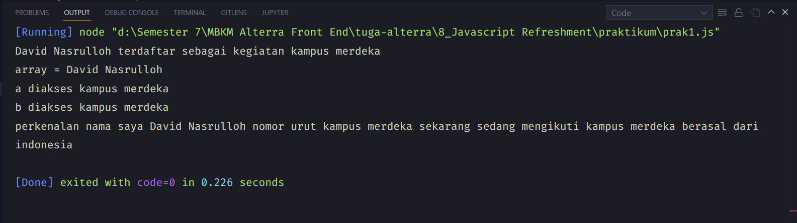
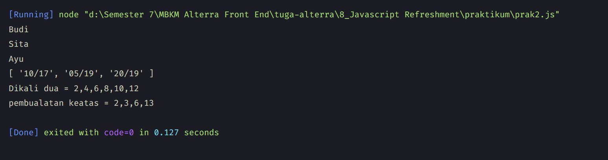

# 8 \_ Javascript Refreshment

> Nama : David Nasrulloh
> Email : davidkrb52@gmail.com
> Univ : Universitas Trunojoyo Madura
> Prodi : Sistem Informasi

---

Dalam materi ini, mempelajari:

- Pengertian Var, Let & Const
- Values & References
- Destructuring
- Method
- Control Flow
- Function
- Async - Await
- Clasess
- DOM

---

## Resume

---

##### Apa itu Declaration ?

proses pembuatan variabel untuk menyimpan data

```
// var
var num1;
console.log(num1);

// let
var num2;
console.log(num2);

// Const
const num3 = 3;
console.log(num3);
```

##### Apa itu Scoping ?

Scoping menentukan dimana variabel, fungsi, dan objek diatur dan dapat diakses dalam kode kita. Ini berarti ruang lingkup variabel dikendalikan oleh lokasi deklarasi variabel.

```
// Global
var name = 'Bani';
let age = 23;
const isMarried = true;

// Function (Local)
function countAverage() {
    var num1 = 7;
    let num2 = 8;
    const num3 = 9;
}

// Block
if (true) {
    var num1 = 7;
    let num2 = 8;
    const num3 = 9;
    num4 = num1 + num2 + num3;
}
```

##### Apa itu Hoisting ?

Hoisting membuat beberapa jenis variabel atau fungsi dapat diakses / digunakan dalam kode sebelum dideklarasikan

```
b = 7;
var b;
console.log(b)

callMe()

function callMe() {
    console.log('Hello Bro!');
}
```

deklarasi var dan function adalah hoisted, oleh karena itu mereka dapat digunakan bahkan sebelum deklarasi itu sendiri terjadi

##### Apa itu Value & Reference ?

value dan reference ada dua yaitu primitive dan object.
Sebelum dibahas lebih jauh, ada hal yang penting untuk dibahas, yang pertama adalah primitive dalam pemrograman adalah unit pemrosesan terkecil dan elemen paling sederhana yang tersedia dalam bahasa pemrograman.
Object adalah unit yang menyimpan properti dan fungsi (method) => {object, array, function, date, set, map, weak set, weak map}

Aturan sederhana untuk meneruskan nilai adalah bahwa semua nilai primitif dalam javascript diteruskan oleh nilai.

```
let a = 1;
let b = a;

const ar1 = [1];
const ar2 = [1];

console.log(ar1 === ar2);
console.log(ar1 === [1]);

const ar3 = ar1;

console.log(ar1 === ar3);
console.log(ar1 === ar1);
```

##### Apa itu Destructuring ?

Destructuring adalah ekspresi dari JavaScript yang memungkinkan untuk menyalin nilai dari array, atau properti dari objek, ke dalam variabel yang berbeda.

```
// Array
let a, b;
[a, b] = [1, 2];
console.log(a);
console.log(b);

const x = [1, 2, 3. 4, 5];
const [y, z] = x;
console.log(y);
console.log(z);

let a, b;
[a = 5, b = 7] = [1];
console.log(a);
console.log(b);

// Object
const user = {
    id = 42,
    is_verified = true
};
const { id, is_verified } = user;
console.log(id);
console.log(is_verified);
```

##### Apa itu Spread ?

Spread syntax dapat digunakan ketika semua elemen dari object atau array perlu dimasukkan ke dalam semacam daftar.

```
// Array
let a = [1, 2, 3];
let b = [...a];
console.log(b);
console.log(a === b);

// Object
const a = { p: 1, q: 2 };
let b = [...a];
console.log(b);
```

#### Method pada Array ?

Method merupakan sebuah fungsi yang terkait dengan object, membuat programnya se-sederhana mungkin sesuai kegunaan masing - masing

Contoh beberapa metode dalam array seperti :

##### Concat

Contoh

```
const array1 = ['a', 'b', 'c'];
const array2 = ['d', 'e', 'f'];
const array3 = array.concat(array2);

console.log(array3);
```

##### Map

Contoh

```
const array4 = [1, 4, 9, 16];
const map1 = array.map(x => x * 2);
console.log(map1);
```

##### Foreach

Contoh

```
const array1 = ['a', 'b', 'c'];
array1.forEach(element => console.log(element));
```

##### Slice

Contoh

```
const Hewan = ['Semut', 'Kambing', 'Unta', 'Bebek', 'Gajah'];
console.log(Hewan.slice(2));
```

##### Filter

Contoh

```
const angka = [1, 2, 3, 4, 5, 6];
const result = angka.filter(nomor => nomor > 2);
console.log(result);
```

##### Reduce

Contoh

```
const array1 = [1, 2, 3, 4];
const reducer = (accumulator, currentValue) => accumulator + currentValue;

console.log(array1.reduce(reducer));
```

##### Apa itu Control Flow ?

- normal flow
  pengekseskusian statement dari atas ke bawah atau kiri ke kanan yang dilakukan secara berurutan
- control flow
  mengatur alur eksekusi pada statement atau jalanan program sesuai keinginan kita

> Pengulangan (Loop / Iterasi)
> For, while, Do While

> Penkondisian (Percabangan)
> If...Else, Swith, Block, Try ... Catch, Break, Continue, Throw

##### Apa itu Function?

Function di dalam Javascript adalah sebuah objek. Karena memiliki properti dan juga method
Function digunakan untuk melakukan serangkaian komputasi / Procedur yang dapat digunakan berulang kali

```
//anonymous function expression
var a = function() {
    return 3;
}

//named function expression
var a = function bar() {
    return 3;
}

//self invoking function expression
(function sayHello() {
    alert("hello!");
})();

//Arrow Function
var multiplyES6 = (x, y) => x * y;
console.log(multiplyES6 (2,3));  // 6
```

##### Async - Await

- Synchronous
- Asynchronous
- Callback
- Promise
- Asynchronous Function
- Await

##### Synchronous

Synchronous mengeksekusi setiap perintah satu persatu sesuai urutan kode yang dituliskan

##### Asynchronous

Asynchronous hasil eksekusi atau output tidak selalu berdasarkan urutan kode, tetapi berdasarkan waktu proses

##### Callback

Callback adalah fungsi yang dikirimkan sebagai parameter pada fungsi lain atau
Callback adalah fungsi yang dieksekusi setelah fungsi lain selesai dijalankan

##### Promise

Promise adalah objek yang mempresentasikan keberhasilan atau kegagalan pada sebuah event yang asyncronous dimasa mendatang
Asynchronous Callback

1. Resolve (Promise terpenuhi) -> .then()
2. Reject (Promise tidak terpenuhi) -> .catch()
3. Finally (Promise proses selesai (optional))
   Asynchronous Function
   Fungsi Ashyncronous sebuah function yang berkerja secara asyncronous yang menghasilkan promise sebagai return value - nya, tetapi cara penulisan code-nya menggunakan penulisan syncronous (standar)

##### Await

Await adalah sebuah keyword yang terdapat pada async function yang tujuannya menghentikan eksekusi sambil menunggu promise-nya selesai.

##### Classes

Hal hal yang penting dalam penerapan Classes, Constructor, Method, Attributes, Extend

```
class Dog extends Animal {
  // Tambahkan constructor
  constructor(name, age, breed) {
    super(name, age);
    this.breed = breed;
  }

  info() {
    this.greet();
    console.log(`Nama saya adalah ${this.name}`);
    // Print 「Saya adalah seekor ____」
    console.log(`Saya adalah seekor ${this.breed}`);

    console.log(`Saya berusia ${this.age} tahun`);
    const humanAge = this.getHumanAge();
    console.log(`Saya berusia ${humanAge} tahun dalam umur manusia`);
  }

  getHumanAge() {
    return this.age * 7;
  }
}

// Tetapkan "Chihuahua" sebagai nilai argument
const dog = new Dog("Leo", 4, "Chihuahua");
dog.info();
```

> Class adalah prototype dari suatu object yang akan kita buat
> Constructor adalah method didalam class yang akan selalu terpanggil pertama kali ketika membuat object
> Method adalah fungsi yang berada didalam class
> Atributes adalah kumpulan variabel yang membentuk objek yang memiliki oleh suatu class
> Extends digunakan untuk membuat kelas anak dari kelas induk. kelas anka mewarisi semua atribut dan metode dari kelas induk.
> DOM adalah adalah API untuk HTML yang mempresentasikan halaman web pada suatu dokumen menjadi sebuah object

Untuk detail dari DOM bisa di cek di website dibawah ini
https://www.w3schools.com/js/js_htmldom.asp

---

### output tugas :

##### Tugas


---

### output praktikum :

##### praktikum




---

31 Agustus 2022 | David Nasrulloh
