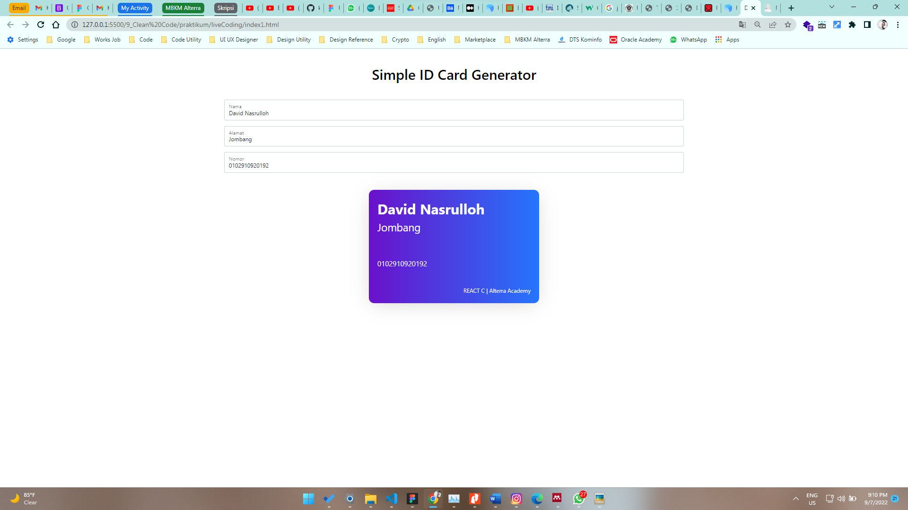
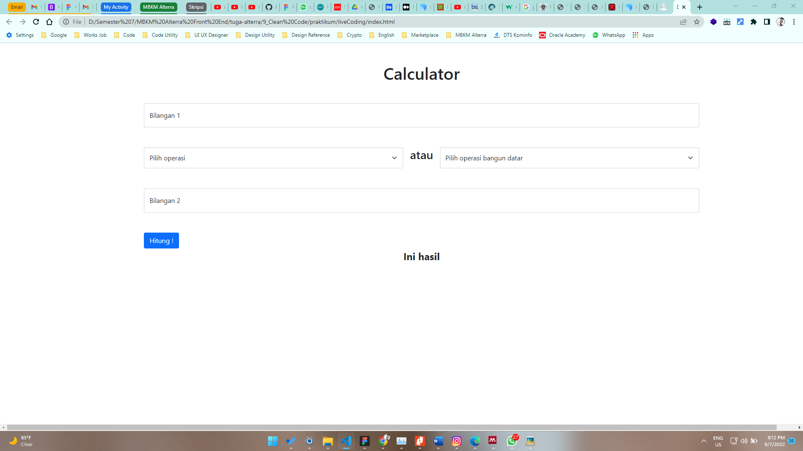

# 9 \_ Clean Code

```
Nama  : David Nasrulloh
Email : davidkrb52@gmail.com
Univ  : Universitas Trunojoyo Madura
Prodi : Sistem Informasi
```

---

Dalam materi ini, mempelajari:

- Apa itu Clean Code ?
- Kenapa Clean Code ?
- 9 Karakteristik Clean Code
- KISS
- DRY
- Refactoring

---

## Resume

---

##### Apa itu Clean Code ?

Clean Code adalah istilah untuk kode yang mudah dibaca, difahami dan diubah oleh programmer

```
"Wroking code isn't neccessary good code. Your code alsi need to be easy to read, understand, and modify"
~ Brandon Gregory

"Any fool can write code that a computer can understand. Good programmers write code that humans can understand."
~ Martin Fowler
```

##### Kenapa "Clean Code" ?

Alasan nya adalah :

1. Work Collaboration
2. Feature Development
3. Faster Development

##### Karakteristik Clean Code

```
"There are only two hard things in Computer Science: cache invalidation and naming things"
~ Martin Fowler
```

1. Mudah difahami
2. Mudah dieja dan dicari
3. Singkat namun mendeskripsikan konteks
4. Konsisten
5. Hindari penambahan konteks yang tidak perlu
6. Komentar
7. Good Function
8. Gunakan konvensi example style guide -> (airbnb, google)
9. Formating

##### Saran "Formating"

1. Lebar baris code 80 - 120 karakter
2. Satu class 300 - 500 baris
3. Baris code yang berhubungan saling berdekatan
4. Bekatkan fungsi dengan pemanggilnya
5. Deklarasi variabel berdekatan dengan penggunanya
6. Perhatikan indentasi
7. Menggunakan prettier dan formatter.

##### Clean Code Principle

> KISS = Keep it So Simple

```
Tips untuk selalu KISS
1. Fungsi atau class harus kecil
2. Fungsi dibuat untuk melakukan satu tugas saja
3. Jangan gunakan terlalu banyak argumen pada fungsi
4. Harus diperhatikan untuk mencapai kondisi yang seimbang, kecil dan jumlahnya minimal
```

> DRY = Dont Repeat Yourself
> Duplikasi code terjadi karena sering copy paste. Untuk menghindari duplikasi code buatlah fungsi yang dapat digunakan secara berulang-ulang.

> Refactoring
> Refactoring adalah proses retrukturisasi kode yang dibuat, dengan cara mengubah struktur internal tanpa mengubah perilaku eksternal. Prinsip KISS dan DRY bisa dicapai dengan cara refactor.
> Teknik Refactoring

1. Membuat sebuah abstraksi
2. Memecah kode dengan fungsi / class
3. Perbaiki penamaan dan lokasi kode
4. Deteksi kode yang memiliki duplikasi

Output Challenge



---

1 September 2022 | David Nasrulloh
